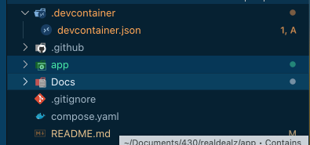
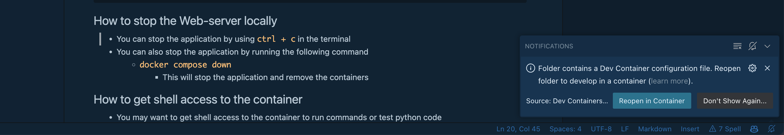

# How to develop this project locally with docker compose

## Prerequisites
1. - You must first have docker / docker-compose installed on your machine
- You can find the installation instructions for docker here: https://docs.docker.com/get-docker/ 
2. - We recommend using vscode as your editor
- You can find the installation instructions for vscode here: https://code.visualstudio.com/download
- You will need to install the Remote - Containers extension for vscode
3. - When you open the project in vscode you will may be prompted to install the Remote - Containers extension for vscode
- You need this extension to open the project inside the container

## How to open a vscode instance inside of the container 
- This is a good way to develop the project locally
- You can use the vscode instance inside the container to edit the code and run the server
- that way you don't have to install dependencies on your machine 
- and you don't have to worry about fancy docker commands to run the server or run migrations


1.  First open the root folder of the project in **vscode** this folder should look like this:

2. Then click the button in the bottom right corner of vscode that says `Reopen in Container`

3. This will open a vscode instance inside the container

If The above Doesn't work try the following 
1. Open the root folder of the project in vscode
2. Open the command palette by pressing `ctrl + shift + p`
3. Type `reopen in container` and select the option `Remote-Containers: Reopen Folder in Container`
- if you dont see this option you may need to install the Remote - Containers extension for vscode this should popup automatically when you open the project in vscode as a recommendation.


## How to start the Web-server locally 

    - on windows this can be powershell or wsl (personal preference)
2. navigate to the root of the project directory 
    - should contain the `docker-compose.yml` file and the app folder
3. You can start the application by running the following command
    - `docker compose up`
        - This will start the application in the foreground
    - `docker compose up -d`
    - You can use the `-d` flag to start the application in the background
4. After the application starts, navigate to `http://localhost:8000` in your web browser:

Expected Results:
```
❯ docker compose up
[+] Running 2/2
 ⠿ Network realdealz_default  Created                                             0.0s
 ⠿ Container realdealz-web-1  Created                                             0.0s
Attaching to realdealz-web-1
realdealz-web-1  | Watching for file changes with StatReloader
```

## How to stop the Web-server locally
- You can stop the application by using `ctrl + c` in the terminal
- You can also stop the application by running the following command
    - `docker compose down`
        - This will stop the application and remove the containers

## How to get shell access to the container 
- You may want to get shell access to the container to run commands or test python code

- This is also a good way to run migrations or create a superuser or other **manage.py django commands**

1. You can verify if docker and the app container are running by using `docker ps`
You should see something like this:
```
❯ docker ps
CONTAINER ID   IMAGE           COMMAND                  CREATED        STATUS         PORTS                    NAMES
3b8dafb6d571   realdealz-web   "python3 manage.py r…"   44 hours ago   Up 3 seconds   0.0.0.0:8000->8000/tcp   realdealz-web-1
```
 __Dont forget  to note the name of the container you want to access in this example realdealz-web-1 is the name of the container, you can find the name of the container__

2. For shell shell access inside the container `docker exec -it realdealz-web-1 ash`
    - This Will open a shell in the container and you can run commands from there like a normal shell
    - for using shell commands like `ls` or `cd`
3. For interactive python shell access inside the container `docker exec -it realdealz-web-1 ipython`
    - This will open an interactive python shell in the container 
    - for using a smart python shell


